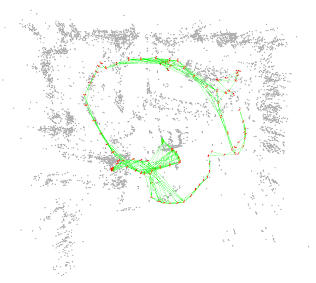
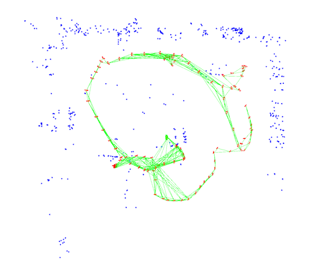
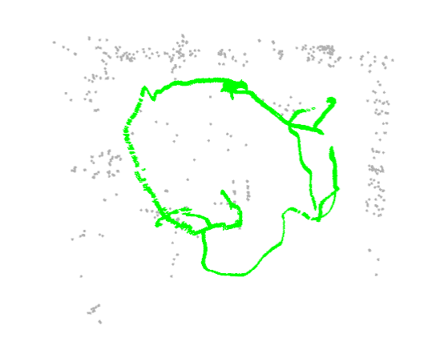

<div align="center">
<h1>SLAM-Map-Compression-OR-Tools</h1>
<h3>Efficient Map Sparsification Based on 2D and 3D Discretized Grids</h3>

ArXiv Preprint ([arXiv 2303.10882](https://arxiv.org/abs/2303.10882))

Accepted in **[CVPR 2023](https://openaccess.thecvf.com/content/CVPR2023/html/Zhang_Efficient_Map_Sparsification_Based_on_2D_and_3D_Discretized_Grids_CVPR_2023_paper.html)**
</div>


## Abstract
Refer to: [fishmarch repo](https://github.com/fishmarch/SLAM_Map_Compression)

The only difference of this repo w.r.t [fishmarch repo](https://github.com/fishmarch/SLAM_Map_Compression) is using OR-Tools instead of Gurobi to achieve the same result of map compression.

## Installation

### ORB-SLAM2
The method is tested with [ORB-SLAM2](https://github.com/raulmur/ORB_SLAM2). Please follow their instruction to install prerequisites.

### ~~Gurobi~~
~~The mix-integer programming is solved using [GUROBI](https://www.gurobi.com).~~

### OR-Tools
Google Optimization Tools (a.k.a., [OR-Tools](https://github.com/google/or-tools)) is an open-source, fast and portable software suite for solving combinatorial optimization problems.

If you want to run this repo, please first install OR-Tools on your machine.
## Running

The method now is testing with RGBD and stereo mode of ORB-SLAM2, and tested in [ICL-NUIM](https://www.doc.ic.ac.uk/~ahanda/VaFRIC/iclnuim.html),
[EuRoC](https://projects.asl.ethz.ch/datasets/doku.php?id=kmavvisualinertialdatasets), and [KITTI](https://www.cvlibs.net/datasets/kitti/eval_odometry.php)
datasets.

Take EuRoC data for example.

### 1. Build and save an original map
```
Examples/Stereo/stereo_euroc_savemap Vocabulary/ORBvoc.txt Examples/Stereo/EuRoC.yaml PATH_TO_SEQUENCE/mav0/cam0/data PATH_TO_SEQUENCE/mav0/cam1/data Examples/Stereo/EuRoC_TimeStamps/SEQUENCE.txt PATH_TO_MAP 
```


### 2. Compress the original map
```
Examples/Tools/slam_compress_map Vocabulary/ORBvoc.txt Examples/Stereo/EuRoC.yaml PATH_TO_MAP PATH_TO_COMPRESSED_MAP COMPRESS_METHPD
```

COMPRESS_METHOD :

- 1: Compress based only on 2D grids
- 2: Compress based on 2D and 3D grids


### 3. Localize in the compressed map
```
Examples/Stereo/stereo_euroc_localize Vocabulary/ORBvoc.txt Examples/Stereo/EuRoC.yaml PATH_TO_SEQUENCE/mav0/cam0/data PATH_TO_SEQUENCE/mav0/cam1/data Examples/Stereo/EuRoC_TimeStamps/SEQUENCE.txt PATH_TO_COMPRESSED_MAP
```


## Acknowledgements

- [ORB-SLAM2](https://github.com/raulmur/ORB_SLAM2)

- [Active-ORB-SLAM2](https://github.com/XinkeAE/Active-ORB-SLAM2)

## Citation
```bibtex
@InProceedings{Zhang_2023_CVPR,
    author    = {Zhang, Xiaoyu and Liu, Yun-Hui},
    title     = {Efficient Map Sparsification Based on 2D and 3D Discretized Grids},
    booktitle = {Proceedings of the IEEE/CVF Conference on Computer Vision and Pattern Recognition (CVPR)},
    month     = {June},
    year      = {2023},
    pages     = {12470-12478}
}
```
